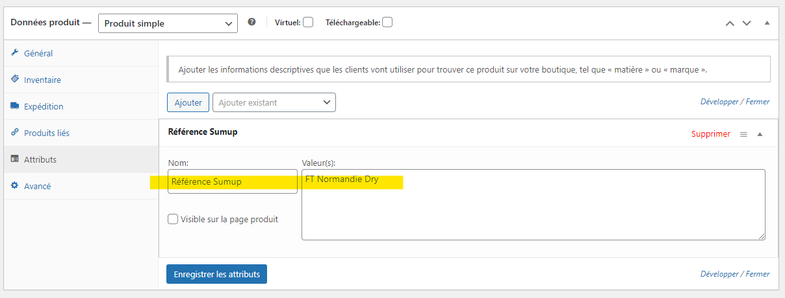
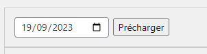
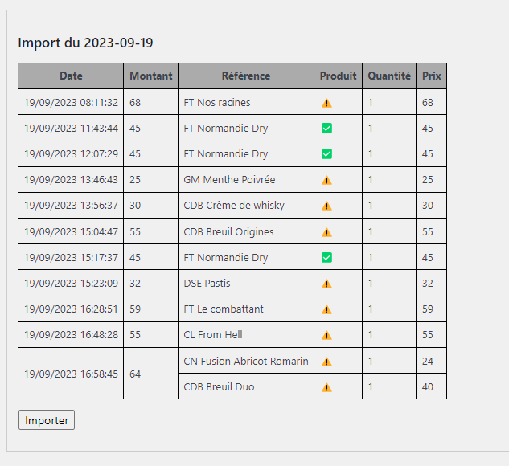
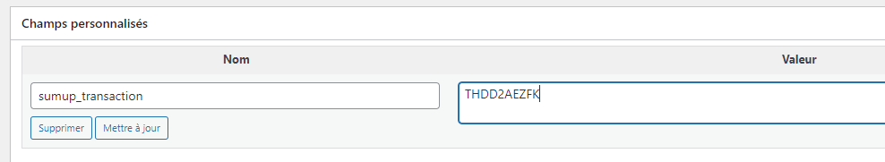

# Sumup Stock

Plugin de MAJ des commandes & stocks WooCommerce depuis Sumup

## Installation

1. [Télécharger le plugin](https://github.com/leahpar/sumup-stock/releases/latest)
2. Dézipper le fichier
3. Copier le dossier `sumup-stock` dans le dossier `wp-content/plugins` de votre site Wordpress
4. Activer le plugin dans le menu `Extensions` de Wordpress
5. Renseigner la clé API Sumup dans le menu `Réglages` > `SumupStock`
6. Enjoy !

## Utilisation

### Référence Sumup

Indiquer la référence Sumup dans l'attribut' "Référence Sumup" de la fiche produit WooCommerce.

### Mise à jour des stocks

1. Aller sur la page de l'outil dans le menu `Outils` > `SumupStock Importer`
2. Choisissez la date du jour à importer

 
3. Cliquer sur le bouton `Précharger`
4. Les transactions du jour sont affichées, en indiquant si le produit est référencé sur WooCommerce.
 

 
5. Cliquer sur le bouton `Importer les commandes`
6. Enjoy !

### Ajout manuel d'une commande

Lors de la création manuelle d'une commande correspondant à une transaction Sumup, 
il est possible d'ajouter le numéro de transaction Sumup dans le champ personnalisé "sumup_transaction".
Ainsi la transaction sera considérée comme importée et ne sera pas importée à nouveau.

## Automatisation

Le traitement d'import peut être automatisé (cron) en l'activant dans le menu `Réglages` > `SumupStock`.
L'import se fait alors toutes les heures, avec un email de rapport si des transactions n'ont pas été importées.

## Documentation

### Woocommerce dev

Search : https://github.com/woocommerce/woocommerce/wiki/wc_get_products-and-WC_Product_Query

Product : https://github.com/woocommerce/woocommerce/blob/3611d4643791bad87a0d3e6e73e031bb80447417/plugins/woocommerce/includes/wc-product-functions.php

Stock : https://github.com/woocommerce/woocommerce/blob/3611d4643791bad87a0d3e6e73e031bb80447417/plugins/woocommerce/includes/wc-stock-functions.php

### Woocommerce Plugin

https://github.com/woocommerce/woocommerce/tree/trunk/docs/extension-development

### Wordpress plugin

DB : https://codex.wordpress.org/Creating_Tables_with_Plugins

### Woocommerce REST API

https://woocommerce.com/document/woocommerce-rest-api/

https://github.com/woocommerce/woocommerce/blob/trunk/docs/rest-api/getting-started.md

### Sumup API

https://developer.sumup.com/docs/online-payments/introduction/register-app/

Oauth : https://developer.sumup.com/docs/api/generate-a-token/

https://developer.sumup.com/docs/api/list-financial-transactions/

